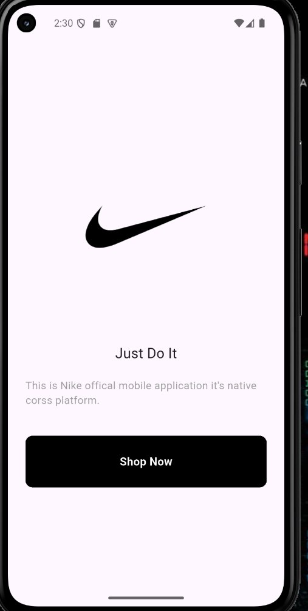
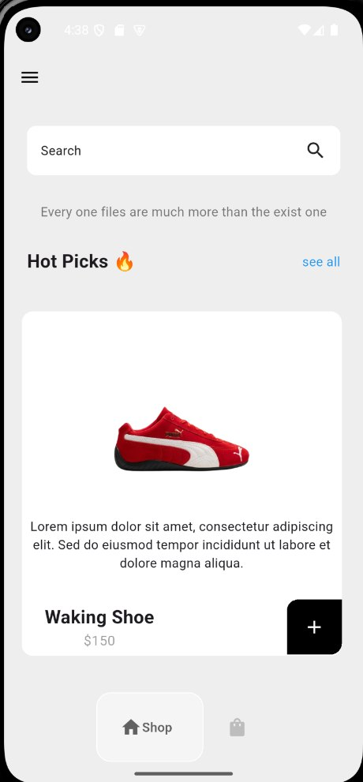
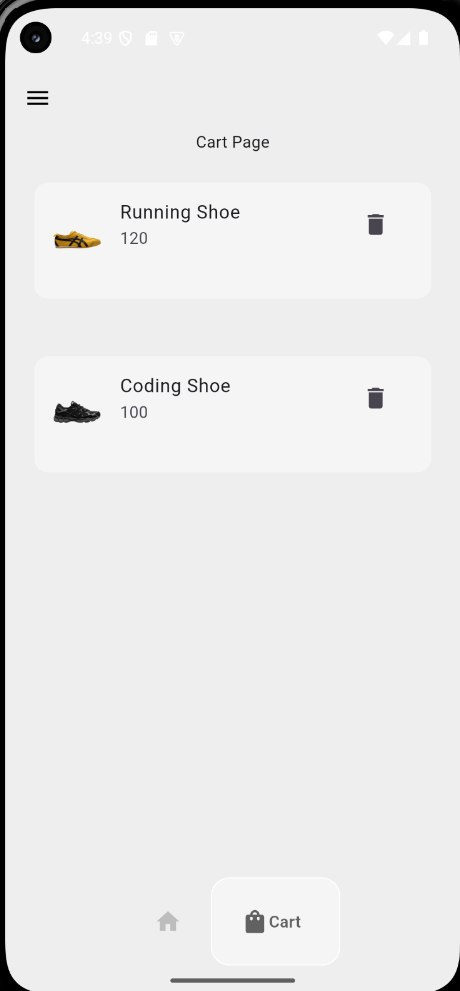

# 👟 Nike Shop UI (Flutter)

A modern Nike shopping application built with Flutter. This project demonstrates Flutter UI development, state management using Provider, and a clean application structure.

##  Features

- Beautiful Nike-inspired UI
- Intro / Welcome Screen
- Home Page
- Shop Page
- Shopping Cart
- Horizontal product list
- Add items to cart
- Remove items from cart
- State management with Provider
- Responsive layout
- Material Design UI

##  Built With

- Flutter
- Dart
- Provider

## Project Structure

```
lib/
│
├── Components/
│   ├── ShoeTile.dart
│   ├── CartItem.dart
│   └── Drawer.dart
│
├── Models/
│   ├── ShoesModel.dart
│   └── CartModel.dart
│
├── Pages/
│   ├── IntroPage.dart
│   ├── HomePage.dart
│   ├── ShopPage.dart
│   └── CartPage.dart
│
└── main.dart
```

## State Management

This project uses **Provider** for state management.

- `ChangeNotifier`
- `ChangeNotifierProvider`
- `Consumer`
- `notifyListeners()`

Provider manages:

- Shop products
- User cart
- Add to cart
- Remove from cart

##  Getting Started

### Clone the repository

```bash
git clone https://github.com/your-username/your-repository.git
```

### Navigate to the project

```bash
cd your-repository
```

### Install dependencies

```bash
flutter pub get
```

### Run the application

```bash
flutter run
```

## Screenshots

## 📸 Screenshots

| Intro | Shop | Cart |
|-------|------|------|
|  |  |  |
```

##  What I Learned

During this project I practiced:

- Flutter Widgets
- Navigation
- Drawer
- ListView.builder
- Custom Widgets
- Provider State Management
- Responsive UI
- Asset Management
- Project Structure
- Shopping Cart Logic

## Future Improvements

- Favorites (Wishlist)
- Product Details Page
- Search Functionality
- Categories
- Dark Mode
- Firebase Authentication
- Payment Integration
- Order History

## Author

**Ananya Teshome**

GitHub: https://github.com/your-username

---
 If you like this project, don't forget to give it a star!